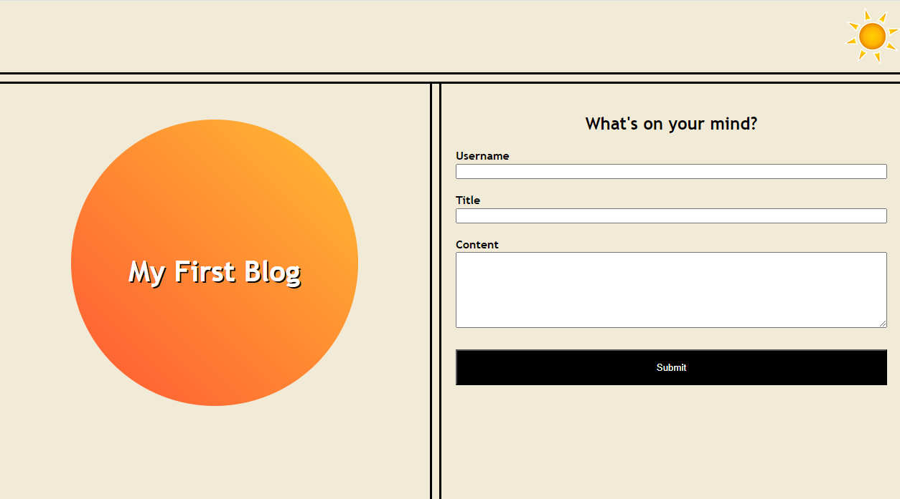
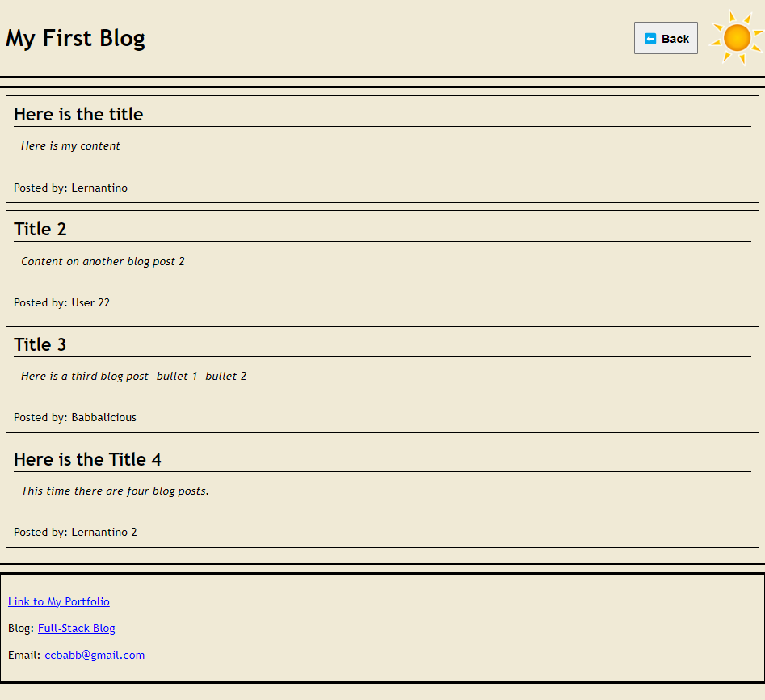

# Personal Blog

## Purpose

This web application allows the user to make blog entries. On the main page, the user can enter a Username, Title, and Content. When the user hits the submit button, the entered data is stored in local storage. The user is then taken to a blog page that displays all blog entries that have been entered.

Additionally, both pages feature a sun or moon icon in the top right. When clicked the user can toggle between light and dark mode on the website.

## Screenshots

## Contact Me

Feel free to reach out to me if you have any questions, suggestions, or collaboration opportunities.

- **Email**: ccbabb@gmail.com
- **GitHub**: https://github.com/Babbalicious

## License

This project is licensed under the [MIT License](https://opensource.org/licenses/MIT).
